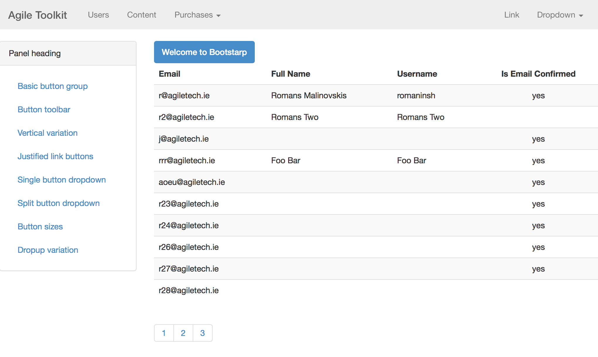

theme-bootstrap
===============

Implements Bootstrap 3 integration for Agile Toolkit.

Installation
----

into your Frontend::init() add:

        $layout = $this->add('theme_bootstrap/Controller')
            ->layoutAdmin();

Don't add jUI (although it might work anyway)

If you wish to use BootStrap items by default, then inside your Frontend::addSharedLocations(){

        $this->defaults = $this->pathfinder->addLocation('my-defaults',array(
            'php'=>'atk4-addons/theme_bootstrap/defaults',
        ))->setBasePath($parent_directory)
        ;

TODOs:

 - [ ] Add support for composer
 - [ ] Add more items to this todo
